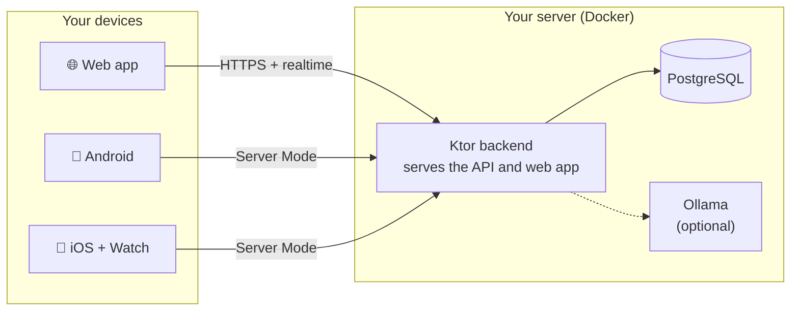

<div align="center">


# T'Day

**A calm, private task planner for web, Android, and iOS. Run it on a server you own, or keep it
entirely on your phone.**

[](https://github.com/ohmzi/Tday/releases/latest)
[](#-get-the-apps)
[](https://testflight.apple.com/join/paKSyGAG)
[](LICENSE)

[](tday-backend)
[](tday-backend)
[](ios-swiftUI)
[](tday-web)
[](tday-web)
[](docs/DATA_MODEL.md)
[](docker-compose.yaml)

[Features](#-features) · [Get the apps](#-get-the-apps) · [Self-host](#-self-host-it) · [Security](#-security-and-privacy) · [Docs](#-documentation) · [Report a bug](https://github.com/ohmzi/Tday/issues/new/choose)

</div>

---

## 👋 What is T'Day?

T'Day is a personal planner that stays out of your way. It shows what's due today, gives the tasks
with no date a place of their own, and doesn't try to turn your to-do list into a game.

- **🔒 Private.** Your tasks live on your device or on a server you run. There is no T'Day cloud,
  no ads, and no analytics.
- **📴 Works offline.** Local Mode needs no server and no sign-up. In Server Mode, changes save on
  the device first and sync when you're back online.
- **📱 Native apps.** A Jetpack Compose app for Android, a SwiftUI app for iOS and Apple Watch, and
  a web app. All three offer the same core features.
- **🌊 Two kinds of tasks.** *Scheduled* tasks have a date and show up in Today and the calendar.
  *Floaters* have no date, so they never go overdue.

There are two ways to use it:

|                       | 📱 Local Mode                         | ☁️ Server Mode                                 |
|-----------------------|---------------------------------------|-----------------------------------------------|
| **Where tasks live**  | On this device only                   | Your own T'Day server, synced to every device |
| **Needs**             | Nothing: pick it on first launch      | A server running Docker ([setup](docs/SETUP.md)) |
| **Good for**          | Trying it out, or staying fully offline | Several devices, the web app, shared lists, integrations |

You can start in Local Mode and move to a server later. The move happens only when you choose to
make it.

---

## ✨ Features

### 🗓️ Plan your day

- **Just type the date.** "Call mom tomorrow 6pm" fills in the due date and cleans up the title.
  The parsing happens on your device, with no AI and no network.
- **Today, Scheduled, and Anytime** feeds, one tap apart.
- **Calendar** with month, week, and day views.
- **Repeating tasks** (daily, weekly, or custom). T'Day offers to make a task repeat when you keep
  finishing it on a rhythm.
- **Overdue help.** Morning Sweep walks you through late tasks one card at a time, and Quick Defer
  moves a task to tonight or next week in one tap.

### 🗂️ Stay organized

- **Lists** for scheduled tasks and for floaters, with colors and automatic icons.
- **Shared lists.** Invite someone on your server as an Editor or a Viewer.
- **Priorities, pinning, drag to reorder, bulk actions, and search.**
- **Reusable checklists** for packing, chores, and groceries, plus a completed history to look back
  on.
- **Resting floaters.** Anytime tasks you haven't touched in a while fade quietly instead of piling
  up.

### 🔔 Reminders

- Reminders with **Snooze** and **Tonight** actions, **quiet hours**, and a **Day Ahead** morning
  digest on Android and iOS.
- **Web push** for the browser, and **UnifiedPush** on Android if you want push without Google.

### 📱 Beyond the app

- **Home-screen widgets** on Android and iOS. Complete and add tasks from the widget, or point it at
  a single list.
- **Apple Watch** app and complication, **iOS Focus filters**, **CarPlay**, and an **Android car
  screen**.
- **Share into T'Day** from any app, and **mirror dated tasks** into your phone's calendar.
- An **installable web app** with keyboard shortcuts and a command palette, in **10 languages**.

### 🔌 Integrations

- **AI assistants.** Claude, Cursor, or any other [MCP](https://modelcontextprotocol.io) client can
  read and manage your tasks through the endpoint built into your server.
- **Personal API keys**, a **[Homarr](https://homarr.dev) dashboard widget**, and a read-only
  **calendar feed** (ICS).
- **Daily summaries**, optionally written by a local [Ollama](https://ollama.com) model. Nothing is
  sent to a cloud AI.

> 📘 **The full feature tour**, with which platform supports what, is in
> **[docs/FEATURES.md](docs/FEATURES.md)**.

---

## 📲 Get the apps

| Platform       | Get it                                                                                      | Requires                         |
|----------------|---------------------------------------------------------------------------------------------|----------------------------------|
| 🌐 **Web**     | Open your T'Day server in a browser. It can be installed as an app (PWA).                  | A T'Day server                   |
| 🤖 **Android** | Download the signed APK from the [latest release](https://github.com/ohmzi/Tday/releases/latest). Later updates install from inside the app. | Android 8.0+ |
| 🍎 **iOS**     | Join the open beta on [TestFlight](https://testflight.apple.com/join/paKSyGAG).            | iOS 17+ and Apple's TestFlight app |

On first launch, both mobile apps ask whether to use **Local** (this device only) or a
**Self-hosted server**. The apps aren't in the App Store or Play Store yet. TestFlight builds expire
90 days after upload, so keep the app updated from TestFlight.

---

## 🧭 How it works



In **Server Mode**, the mobile apps write to an on-device cache first (Room on Android, SwiftData on
iOS) and replay the changes to your server in the background. That keeps them fast on a weak
connection. In **Local Mode**, nothing leaves the device.

More detail: [ARCHITECTURE.md](docs/ARCHITECTURE.md).

---

## 🚀 Self-host it

You need Docker with the Compose plugin.

```bash
git clone https://github.com/ohmzi/Tday.git && cd Tday
cp .env.example .env.docker
openssl rand -base64 32        # paste the output into AUTH_SECRET in .env.docker
docker compose up -d
```

Open <http://localhost:2525> and register. **The first account becomes the admin.** Anyone who
signs up after that waits for your approval.

Things to know before you rely on it:

- **The server only listens on localhost by default.** To use it from your phone, put a tunnel or VPN
  in front, such as Cloudflare Tunnel or Tailscale. [REMOTE_ACCESS.md](docs/REMOTE_ACCESS.md) walks
  through each option.
- **Keep the server and the apps on the same release.** Server Mode checks the versions and asks you
  to update whichever side is behind.
- **AI summaries are optional.** Set `OLLAMA_URL=http://ollama:11434` in `.env.docker` and start
  with `docker compose --profile ai up -d`.

> 📘 **The full setup guide** covers configuration, remote access, AI, web push, updating, backups,
> and troubleshooting: **[docs/SETUP.md](docs/SETUP.md)**.

---

## 🛠️ Built with

| Layer         | Technology                                                                               |
|---------------|------------------------------------------------------------------------------------------|
| **Web**       | React 18, TypeScript, Vite, Tailwind CSS 4, TanStack Query, i18next                      |
| **Backend**   | Kotlin, Ktor, Exposed, Flyway, Koin                                                      |
| **Database**  | PostgreSQL 15                                                                            |
| **Shared**    | Kotlin Multiplatform DTOs, validators, and route constants                               |
| **Android**   | Jetpack Compose, Material 3, Hilt, Room, Retrofit, WorkManager, Glance widgets           |
| **iOS**       | SwiftUI, SwiftData, Observation, WidgetKit, App Intents, CarPlay, watchOS                |
| **Auth**      | Encrypted JWE session cookies (Nimbus JOSE), PBKDF2 password hashing                     |
| **AI**        | Optional local Ollama model, with a built-in fallback                                    |
| **Infra**     | Docker Compose, GitHub Actions, GitHub Container Registry                                |

---

## 🔐 Security and privacy

T'Day holds your personal plans, so it's built to be safe to self-host:

- **Passwords** are hashed with PBKDF2-HMAC-SHA256 (310,000 iterations). **Sessions** are encrypted
  JWE cookies, and changing your password or signing out revokes them on every device.
- **New accounts wait for admin approval.** Sign-in is rate-limited, with an exponential lockout
  after repeated failures.
- **The server binds to localhost by default** and sends strict security headers, including an
  enforcing Content Security Policy. CORS is deny-by-default.
- **Optional AES-256-GCM encryption** of sensitive database fields at rest, with key rotation.
- **Mobile credentials** are stored in the iOS Keychain and in Android's encrypted storage. Local
  Mode data never leaves the device.
- **No analytics or ad tracking.** Crash reports (Sentry) contain only diagnostics, never task
  content, emails, or IP addresses. A self-hosted server sends nothing unless you configure a DSN.
  See [TELEMETRY.md](docs/TELEMETRY.md).

> ⚠️ **Found a vulnerability?** Please report it privately as described in
> **[SECURITY.md](SECURITY.md)**. Don't open a public issue. The full picture is in
> [SECURITY_POSTURE.md](docs/security/SECURITY_POSTURE.md) (threat model and known gaps) and
> [SECURITY_CONTROLS.md](docs/security/SECURITY_CONTROLS.md) (every control, with where it's
> enforced).

---

## 🧑‍💻 Development

T'Day is a monorepo:

| Folder                                   | What's inside                                                 |
|------------------------------------------|---------------------------------------------------------------|
| [`tday-web/`](tday-web)                  | Web app (Vite + React)                                        |
| [`tday-backend/`](tday-backend)          | API server (Ktor), which also serves the built web app        |
| [`shared/`](shared)                      | Kotlin Multiplatform contracts shared by backend and Android  |
| [`android-compose/`](android-compose)    | Native Android app                                            |
| [`ios-swiftUI/`](ios-swiftUI)            | Native iOS, widget, share, and Apple Watch targets            |

```bash
bash scripts/install-hooks.sh                   # one-time, after cloning
cd tday-web && npm install && npm run dev       # web app on http://localhost:5173
./gradlew :tday-backend:run                     # API on http://localhost:8080 (needs PostgreSQL)
```

[CONTRIBUTING.md](CONTRIBUTING.md) covers the full development setup and conventions, and
[TESTING.md](docs/TESTING.md) covers the checks for each platform. The whole repository tree is in
[ARCHITECTURE.md → Repository Layout](docs/ARCHITECTURE.md#repository-layout).

---

## 📚 Documentation

**Using and running T'Day**

| Document                                              | What's in it                                                                 |
|-------------------------------------------------------|------------------------------------------------------------------------------|
| 🚀 [SETUP.md](docs/SETUP.md)                          | Self-hosting: install, configure, connect apps, AI, push, update, back up    |
| ✨ [FEATURES.md](docs/FEATURES.md)                    | Feature tour, platform availability, widgets, car surfaces, integrations     |
| 🌐 [REMOTE_ACCESS.md](docs/REMOTE_ACCESS.md)          | Cloudflare Tunnel, Tailscale, WireGuard, ZeroTier, SSH, ngrok, frp           |
| 🔌 [API_INTEGRATION.md](docs/API_INTEGRATION.md)      | API keys, endpoints, calendar feed, export/import, the Homarr widget         |
| 🤖 [MCP.md](docs/MCP.md)                              | Connecting an AI assistant: clients, key scopes, tool reference              |
| 🔐 [SECURITY.md](SECURITY.md)                         | Reporting vulnerabilities, auth, sessions, data protection                   |
| 📡 [TELEMETRY.md](docs/TELEMETRY.md)                  | What crash reporting collects, and what it never does                        |

**Building T'Day**

| Document                                                   | What's in it                                                            |
|------------------------------------------------------------|-------------------------------------------------------------------------|
| 🧭 [PRODUCT_DIRECTION.md](docs/PRODUCT_DIRECTION.md)       | Product goals, mobile rules, Local Mode, Floater/Anytime direction      |
| 🏗️ [ARCHITECTURE.md](docs/ARCHITECTURE.md)                 | System design, platform architecture, data flow, repository layout      |
| 🗃️ [DATA_MODEL.md](docs/DATA_MODEL.md)                     | Tables, shared DTOs, mobile cache records, the sync mutation queue      |
| 📐 [API_GUIDELINES.md](docs/API_GUIDELINES.md)             | REST and WebSocket contracts and conventions                            |
| 🧑‍💻 [CONTRIBUTING.md](CONTRIBUTING.md)                     | Development setup, branches, commits, PR process                        |
| ✍️ [CODING_STANDARDS.md](docs/CODING_STANDARDS.md)         | Code quality rules, naming, patterns                                    |
| 🧪 [TESTING.md](docs/TESTING.md)                           | Test strategy and per-platform commands                                 |
| 🚢 [DEPLOYMENT.md](docs/DEPLOYMENT.md)                     | Docker image, CI/CD, releases, signing, configuration reference         |
| 🔔 [WIDGET_SYNC.md](docs/WIDGET_SYNC.md)                   | Widget refresh architecture and platform checklists                     |
| 🎨 [ICONS.md](docs/ICONS.md) · [motion.md](docs/motion.md) | The shared Lucide icon set and motion tokens                            |
| 🩺 [SENTRY_RUNBOOK.md](docs/SENTRY_RUNBOOK.md)             | Sentry setup, alerting, and failure triage                              |
| 🧹 [REPO_HOUSEKEEPING.md](docs/REPO_HOUSEKEEPING.md)       | Docs audit, generated files, repo hygiene                               |
| 📜 [adr/](docs/adr)                                        | Architecture Decision Records                                           |
| 🤖 [AGENTS.md](AGENTS.md)                                  | The working agreement for AI coding agents                              |

Platform guides: [Android](android-compose/README.md) · [iOS](ios-swiftUI/README.md)

---

## 🤝 Contributing

Bug reports, feature ideas, and security reports are welcome. Please
[open an issue](https://github.com/ohmzi/Tday/issues/new/choose) and the maintainer will take it
from there.

**Pull requests are not accepted at this time.** T'Day is published so it can be audited and
self-hosted, not to collect code contributions. See [CONTRIBUTING.md](CONTRIBUTING.md).

---

## 📄 License

T'Day is **source-available, not open source**. You're welcome to read and audit the code,
self-host it on hardware you control, modify your own copy, and use the official apps with your
server, all free for personal and household use. Organizational or commercial deployment,
redistribution, and independent app builds need written permission.

See [LICENSE](LICENSE) for the exact terms and [THIRD-PARTY-NOTICES.md](THIRD-PARTY-NOTICES.md) for
the open-source components T'Day builds on.

<div align="center">

<sub>Made for calm, focused days · <a href="#top">Back to top ↑</a></sub>

</div>
