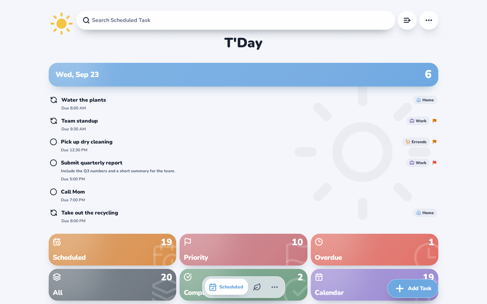
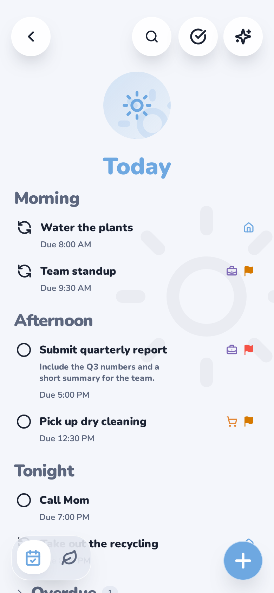
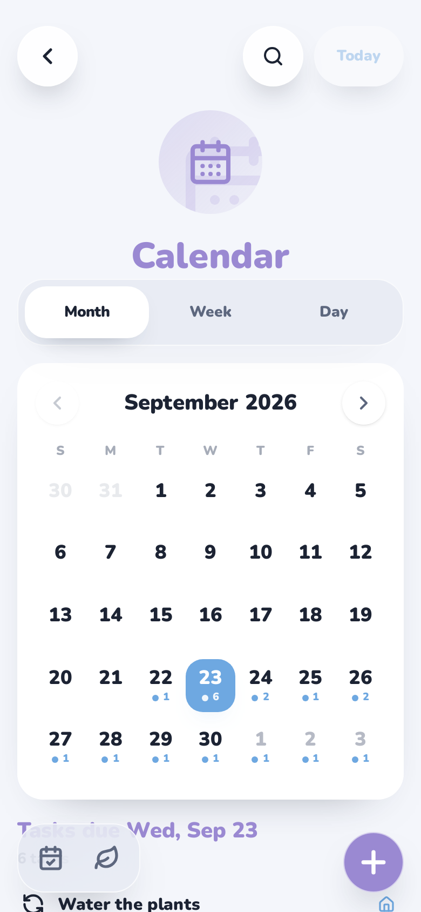
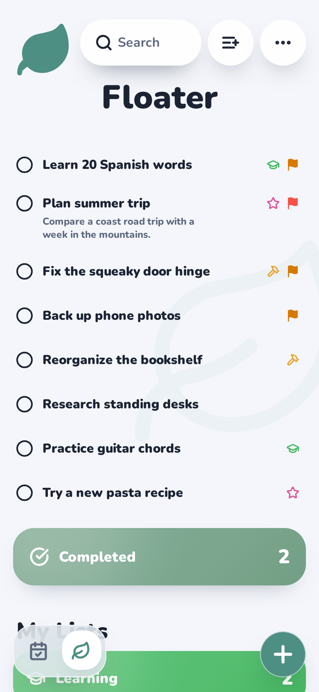
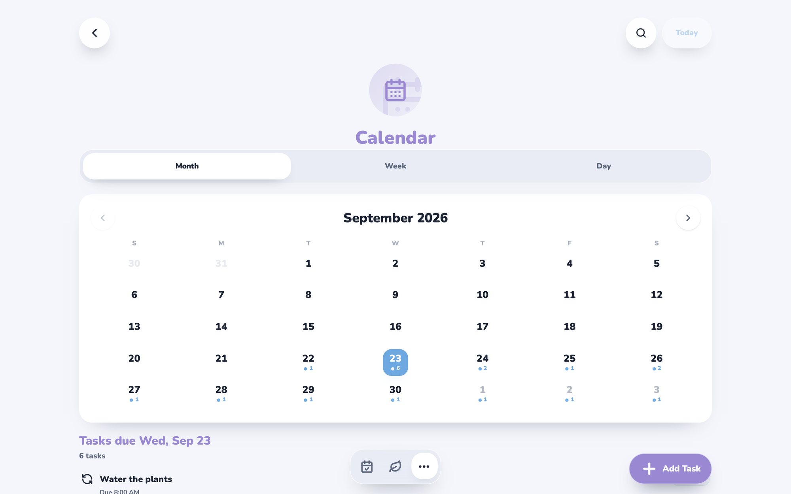
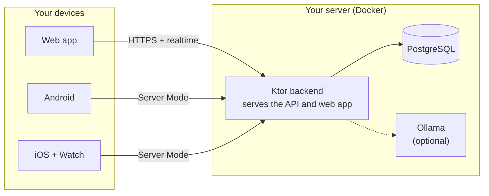

<div align="center">


# T'Day

**A calm, private task planner for web, Android, and iOS. Run it on a server you own, or keep it
entirely on your phone.**

<sub>Self-hosted · works offline · native Android and iOS apps · open source (AGPL-3.0)</sub>

[](https://github.com/ohmzi/Tday/releases/latest)
[](#get-the-apps)
[](https://testflight.apple.com/join/paKSyGAG)
[](LICENSE)

[Features](#features) · [Screenshots](#screenshots) · [Get the apps](#get-the-apps) · [Self-host](#self-host-it) · [How it's built](#how-tday-is-built) · [Security](#security-and-privacy) · [Docs](#documentation) · [Report a bug](https://github.com/ohmzi/Tday/issues/new/choose)

</div>

---

## What is T'Day?

T'Day is a personal planner that stays out of your way. It shows what's due today, gives the tasks
with no date a place of their own, and doesn't try to turn your to-do list into a game.

- **Private.** Your tasks live on your device or on a server you run. T'Day has no cloud service
  of its own, and it collects no analytics.
- **Works offline.** Local Mode needs no server and no sign-up. In Server Mode, changes save on
  the device first and sync when you're back online.
- **Native apps.** A Jetpack Compose app for Android, a SwiftUI app for iOS and Apple Watch, and
  a web app. All three offer the same core features.
- **Two kinds of tasks.** *Scheduled* tasks have a date and show up in Today and the calendar.
  *Floaters* have no date, so they never go overdue.

|                       | Local Mode                              | Server Mode                                             |
|-----------------------|-----------------------------------------|---------------------------------------------------------|
| **Where tasks live**  | On this device only                     | Your own T'Day server, synced to every device           |
| **Needs**             | Nothing: pick it on first launch        | A server running Docker ([setup](docs/SETUP.md))        |
| **Good for**          | Trying it out, or staying fully offline | Several devices, the web app, shared lists, integrations |

You can start in Local Mode and move to a server later. The move happens only when you choose to
make it.

### Why another task app?

Good self-hosted task apps already exist, such as Vikunja, Donetick and Nextcloud Tasks. T'Day is
for you if you want native phone apps that keep working offline, a phone-only mode with no server
at all, undated tasks that never go overdue, and a planner without streaks or points. If you need
team projects or Kanban boards, T'Day isn't built for that.

---

## Screenshots

<div align="center">

<picture>
  <source media="(prefers-color-scheme: dark)" srcset="docs/assets/readme/desktop-home-dark.png">
  
</picture>

<picture>
  <source media="(prefers-color-scheme: dark)" srcset="docs/assets/readme/mobile-today-dark.png">
  
</picture>
<picture>
  <source media="(prefers-color-scheme: dark)" srcset="docs/assets/readme/mobile-calendar-dark.png">
  
</picture>
<picture>
  <source media="(prefers-color-scheme: dark)" srcset="docs/assets/readme/mobile-floater-dark.png">
  
</picture>

</div>

<details>
<summary><b>The calendar on desktop</b></summary>
<br/>
<div align="center">

<picture>
  <source media="(prefers-color-scheme: dark)" srcset="docs/assets/readme/desktop-calendar-dark.png">
  
</picture>

</div>
</details>

<sub>Shown with demo data. Screenshots follow your GitHub light or dark theme.</sub>

---

## Features

### Plan your day

- **Just type the date.** "Call mom tomorrow 6pm" fills in the due date and cleans up the title.
  The parsing happens on your device, with no AI and no network.
- **Today, Scheduled, and Anytime** feeds, one tap apart, plus a **calendar** with month, week, and
  day views.
- **Repeating tasks** (daily, weekly, or custom). T'Day offers to make a task repeat when you keep
  finishing it on a rhythm.
- **Overdue help.** Morning Sweep walks you through late tasks one card at a time, and Quick Defer
  moves a task to tonight or next week in one tap.

### Stay organized

- **Lists** for scheduled tasks and for floaters, with colors and automatic icons, and **shared
  lists** with Editor or Viewer access.
- **Priorities, pinning, drag to reorder, bulk actions, and search.**
- **Reusable checklists**, a completed history, and **resting floaters** that fade quietly instead
  of piling up.

### Reminders and surfaces

- Reminders with **Snooze** and **Tonight** actions, **quiet hours**, and a **Day Ahead** digest.
  **Web push** and **UnifiedPush** are also available.
- **Home-screen widgets**, **Apple Watch**, **iOS Focus filters**, **CarPlay**, and an **Android
  car screen**.
- **Share into T'Day** from any app, and **mirror dated tasks** into your phone's calendar.
- An **installable web app** with keyboard shortcuts and a command palette, in **10 languages**.

### Integrations

- **AI assistants.** Claude, Cursor, or any other [MCP](https://modelcontextprotocol.io) client can
  read and manage your tasks through an endpoint built into your server.
- **API keys**, a **[Homarr](https://homarr.dev) dashboard widget**, and a read-only **calendar
  feed** (ICS).
- **Daily summaries**, optionally written by a local [Ollama](https://ollama.com) model. Nothing is
  sent to a cloud AI.

The full feature tour, with which platform supports what, is in
**[docs/FEATURES.md](docs/FEATURES.md)**.

---

## Get the apps

| Platform       | Get it                                                                             | Requires                           |
|----------------|------------------------------------------------------------------------------------|------------------------------------|
| **Web**        | Open your T'Day server in a browser. It can be installed as an app (PWA).         | A T'Day server                     |
| **Android**    | The signed APK from the [latest release](https://github.com/ohmzi/Tday/releases/latest). It updates itself. | Android 8.0+ |
| **iOS**        | The open beta on [TestFlight](https://testflight.apple.com/join/paKSyGAG).        | iOS 17+ and Apple's TestFlight app |

On first launch, both mobile apps ask whether to use **Local** (this device only) or a
**Self-hosted server**. The apps aren't in the App Store or Play Store yet.

---

## How it works



In **Server Mode**, the mobile apps write to an on-device cache first (Room on Android, SwiftData on
iOS) and replay the changes to your server in the background. That keeps them fast on a weak
connection. In **Local Mode**, your tasks never leave the device. More detail:
[ARCHITECTURE.md](docs/ARCHITECTURE.md).

---

## Self-host it

```bash
git clone https://github.com/ohmzi/Tday.git && cd Tday
cp .env.example .env.docker
openssl rand -base64 32        # paste the output into AUTH_SECRET in .env.docker
docker compose up -d
```

Open <http://localhost:2525> and register. **The first account becomes the admin.** Anyone who
signs up after that waits for your approval.

- **The server only listens on localhost by default.** To reach it from your phone, put a tunnel or
  VPN in front, such as Cloudflare Tunnel or Tailscale ([REMOTE_ACCESS.md](docs/REMOTE_ACCESS.md)).
- **Keep the server and the apps on the same release.** Server Mode checks the versions and asks you
  to update whichever side is behind.
- **AI summaries are optional.** Set `OLLAMA_URL=http://ollama:11434` in `.env.docker` and start
  with `docker compose --profile ai up -d`.

**[docs/SETUP.md](docs/SETUP.md)** is the full guide: configuration, remote access, AI, web push,
updating, backups, and troubleshooting.

---

## Built with

<div align="center">


<br/>


<br/>


</div>

Android uses Hilt, Room, Retrofit, WorkManager, and Glance widgets. iOS uses SwiftData, Observation,
WidgetKit, App Intents, and CarPlay. The layout of each platform is in
[ARCHITECTURE.md](docs/ARCHITECTURE.md).

---

## How T'Day is built

T'Day has one developer, [@ohmzi](https://github.com/ohmzi). Most of the code is written by AI
coding agents, mainly Claude Code, with other assistants at times. That's how one person keeps a
web app, two native apps and a server in step.

What I do myself:

- Decide what gets built, the data model and the architecture.
- Read the diff of every pull request before it merges.
- Test changes on my own phones, browser and server.
- Use T'Day every day, on my own server.

What every change has to get past:

- The rules in [AGENTS.md](AGENTS.md), which the coding agents follow: architecture boundaries,
  privacy rules for telemetry, and the builds and tests each platform must pass.
- CI on pull requests: web lint, type-check and tests; backend and shared-module tests; Android
  unit tests; iOS build and tests; and checks that generated files haven't drifted from their
  sources.
- Guardrail tests that check the crash-reporting privacy rules on every platform.
- CodeQL code scanning and Dependabot dependency updates.

Commits don't carry AI trailers; this section is the disclosure instead. Known security gaps are
listed in [SECURITY_POSTURE.md](docs/security/SECURITY_POSTURE.md).

---

## Security and privacy

- **Passwords** are hashed with PBKDF2-HMAC-SHA256 (310,000 iterations). **Sessions** are encrypted
  JWE cookies, and changing your password or signing out revokes them on every device.
- **New accounts wait for admin approval.** Sign-in is rate-limited, with an exponential lockout
  after repeated failures.
- **The server binds to localhost by default** and sends strict security headers, including an
  enforcing Content Security Policy. CORS is deny-by-default.
- **Optional AES-256-GCM encryption** of sensitive database fields at rest, with key rotation.
- **Mobile credentials** are stored in the iOS Keychain and in Android's encrypted storage. Local
  Mode data never leaves the device.
- **No analytics or ad tracking.** Crash reporting (Sentry) is off unless you add your own DSN;
  the published builds don't include one. When it's on, reports contain only diagnostics, never
  task content, emails, or IP addresses ([TELEMETRY.md](docs/TELEMETRY.md)).
- **Update checks go to GitHub.** The web, Android and iOS apps ask GitHub's public API whether a
  new T'Day release exists, and the web app loads release notes from `raw.githubusercontent.com`.
  These requests carry no account or task data, but GitHub sees your IP address. They also run in
  Local Mode.

**Found a vulnerability?** Report it privately as described in **[SECURITY.md](SECURITY.md)**, not in
a public issue. The threat model and known gaps are in
[SECURITY_POSTURE.md](docs/security/SECURITY_POSTURE.md), and every control, with where it's
enforced, is in [SECURITY_CONTROLS.md](docs/security/SECURITY_CONTROLS.md).

---

## FAQ

<details>
<summary><b>Do I need a server?</b></summary>
<br/>

No. The Android and iOS apps work fully in Local Mode, with no account and no network. A server
adds sync across devices, the web app, shared lists, and integrations. You can move your Local Mode
data to a server later with export and import.

</details>

<details>
<summary><b>Does T'Day send my tasks anywhere?</b></summary>
<br/>

Only to the server you choose. Date parsing runs on the device. AI summaries use a local Ollama
model or a built-in fallback, never a cloud AI. Crash reports never include task content.

</details>

<details>
<summary><b>Does T'Day contact anything besides my server?</b></summary>
<br/>

GitHub, to check for new releases and, on Android, to download them (see
[Security and privacy](#security-and-privacy)). Everything else is opt-in: crash reports go to
Sentry only if you set a DSN, push notifications go through your browser's push service or your
UnifiedPush distributor, and the optional Ollama container downloads its model from Ollama's
registry.

</details>

<details>
<summary><b>Why isn't it in the App Store or Play Store?</b></summary>
<br/>

It's still in beta. iOS builds ship through TestFlight, which expires each build 90 days after
upload, so keep it updated there. Android builds are signed APKs on the Releases page, and the app
installs later releases itself.

</details>

---

## Development

| Folder                                   | What's inside                                                |
|------------------------------------------|--------------------------------------------------------------|
| [`tday-web/`](tday-web)                  | Web app (Vite + React)                                       |
| [`tday-backend/`](tday-backend)          | API server (Ktor), which also serves the built web app       |
| [`shared/`](shared)                      | Kotlin Multiplatform contracts shared by backend and Android |
| [`android-compose/`](android-compose)    | Native Android app                                           |
| [`ios-swiftUI/`](ios-swiftUI)            | Native iOS, widget, share, and Apple Watch targets           |

```bash
bash scripts/install-hooks.sh                   # one-time, after cloning
cd tday-web && npm install && npm run dev       # web app on http://localhost:5173
./gradlew :tday-backend:run                     # API on http://localhost:8080 (needs PostgreSQL)
```

[CONTRIBUTING.md](CONTRIBUTING.md) covers the full setup and conventions, and
[TESTING.md](docs/TESTING.md) covers the checks for each platform.

---

## Documentation

| Document                                              | What's in it                                                               |
|-------------------------------------------------------|----------------------------------------------------------------------------|
| [SETUP.md](docs/SETUP.md)                          | Self-hosting: install, configure, connect apps, AI, push, update, back up  |
| [FEATURES.md](docs/FEATURES.md)                    | Feature tour, platform availability, widgets, car surfaces, integrations   |
| [REMOTE_ACCESS.md](docs/REMOTE_ACCESS.md)          | Cloudflare Tunnel, Tailscale, WireGuard, ZeroTier, SSH, ngrok, frp         |
| [API_INTEGRATION.md](docs/API_INTEGRATION.md)      | API keys, endpoints, calendar feed, export/import, the Homarr widget       |
| [MCP.md](docs/MCP.md)                              | Connecting an AI assistant: clients, key scopes, tool reference            |
| [SECURITY.md](SECURITY.md)                         | Reporting vulnerabilities, auth, sessions, data protection                 |
| [TELEMETRY.md](docs/TELEMETRY.md)                  | What crash reporting collects, and what it never does                      |

<details>
<summary><b>For developers: architecture, data, testing, and more</b></summary>
<br/>

| Document                                                   | What's in it                                                            |
|------------------------------------------------------------|-------------------------------------------------------------------------|
| [PRODUCT_DIRECTION.md](docs/PRODUCT_DIRECTION.md)       | Product goals, mobile rules, Local Mode, Floater/Anytime direction      |
| [ARCHITECTURE.md](docs/ARCHITECTURE.md)                 | System design, platform architecture, data flow, repository layout      |
| [DATA_MODEL.md](docs/DATA_MODEL.md)                     | Tables, shared DTOs, mobile cache records, the sync mutation queue      |
| [API_GUIDELINES.md](docs/API_GUIDELINES.md)             | REST and WebSocket contracts and conventions                            |
| [CONTRIBUTING.md](CONTRIBUTING.md)                     | Development setup, branches, commits, PR process                        |
| [CODING_STANDARDS.md](docs/CODING_STANDARDS.md)         | Code quality rules, naming, patterns                                    |
| [TESTING.md](docs/TESTING.md)                           | Test strategy and per-platform commands                                 |
| [DEPLOYMENT.md](docs/DEPLOYMENT.md)                     | Docker image, CI/CD, releases, signing, configuration reference         |
| [WIDGET_SYNC.md](docs/WIDGET_SYNC.md)                   | Widget refresh architecture and platform checklists                     |
| [ICONS.md](docs/ICONS.md) · [motion.md](docs/motion.md) | The shared Lucide icon set and motion tokens                            |
| [SENTRY_RUNBOOK.md](docs/SENTRY_RUNBOOK.md)             | Sentry setup, alerting, and failure triage                              |
| [REPO_HOUSEKEEPING.md](docs/REPO_HOUSEKEEPING.md)       | Docs audit, generated files, repo hygiene                               |
| [adr/](docs/adr)                                        | Architecture Decision Records                                           |
| [AGENTS.md](AGENTS.md)                                  | The rules the AI coding agents follow ([how T'Day is built](#how-tday-is-built)) |

Platform guides: [Android](android-compose/README.md) · [iOS](ios-swiftUI/README.md)

</details>

---

## Contributing

- **Found a bug?** [Open an issue](https://github.com/ohmzi/Tday/issues/new/choose).
- **Have an idea?** [Suggest a feature](https://github.com/ohmzi/Tday/issues/new/choose).
- **Security concern?** Follow [SECURITY.md](SECURITY.md) and report it privately.

**Pull requests are not accepted at this time.** T'Day is published so it can be audited and
self-hosted, not to collect code contributions. See [CONTRIBUTING.md](CONTRIBUTING.md).

---

## License

T'Day is open source under the [GNU Affero General Public License v3.0](LICENSE). You can run it,
study it, change it and share it. If you run a changed version for other people over a network,
you have to offer them its source code too.

The T'Day name and logo aren't covered by the license, so a fork should use its own.
[THIRD-PARTY-NOTICES.md](THIRD-PARTY-NOTICES.md) lists the open-source components T'Day builds on.

<div align="center">

<sub>Made for calm, focused days · <a href="#top">Back to top</a></sub>

</div>
